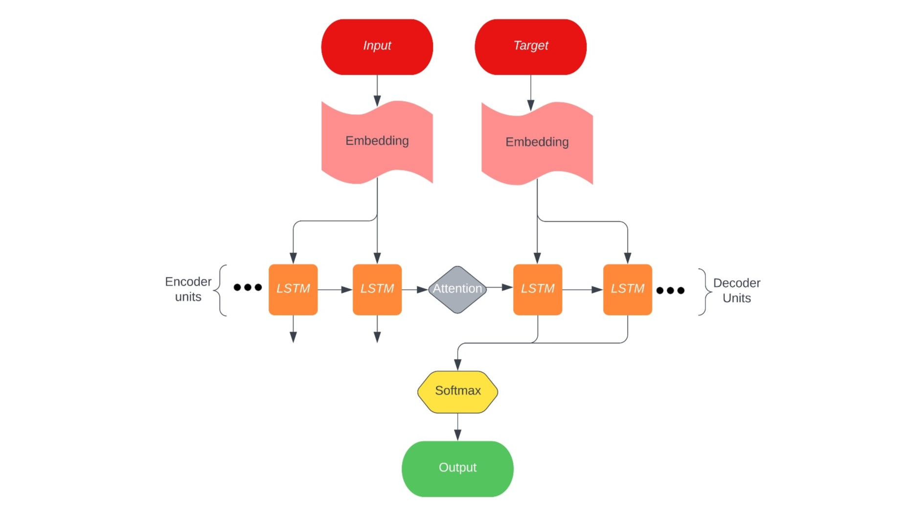

# Recurrent Neural Network

A sequence to sequence recurrent neural network that incrementally answers general questions, built using Python, Tensorflow, and Keras.
Base RNN model supplemented by Long Short-Term memory cells, a Bahdanau attention mechanism, and information retrieval methods. 

